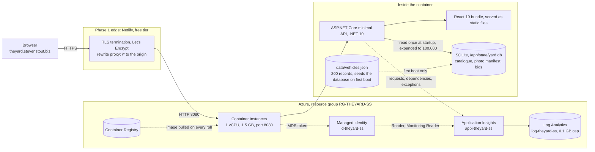
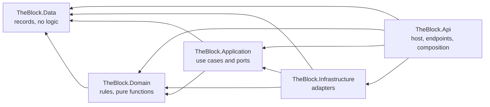

# App Architecture

The shape of the whole application in one page: what each part owns, which
way the dependencies point, and the rules that keep it that way. The
records under this one in the sidebar explain the individual decisions;
this is the map they hang from. It is also the answer to the promise the
README made when the build started, that a written architecture and style
would exist and be enforced rather than remembered.

[](https://theyard.stevenstout.biz/api/docs/diagrams/dataflow)

*A preview. [Open the data flow diagram in a new page](https://theyard.stevenstout.biz/api/docs/diagrams/dataflow)
to zoom in and follow it. The infrastructure has [its own drawing](https://theyard.stevenstout.biz/api/docs/diagrams/infrastructure).*

## The topology, in the document

The two drawings above are pictures. This one is text: it lives in this file,
changes in the same commit as the thing it describes, and shows up in a diff
when the topology moves. That is the whole reason it is here in a format a
reviewer can read as source rather than open in an editor.

Solid lines are what serves a request today. Dotted lines are the deploy path
and the identity path, which are real but not on the request's critical route.



*Mermaid source. It renders as a picture on GitHub, and it is kept here as text
on purpose: it lives in this file, so it changes in the same commit as the
topology and shows up in a diff. The drawn version of the same thing, to zoom
in on, is the [infrastructure diagram](https://theyard.stevenstout.biz/api/docs/diagrams/infrastructure).
Why the renderer is not in the bundle is measured in ADR: Style, enforced.*

The two things that are not on this picture are on it on purpose. Cloudflare
is a staged, dormant zone that cannot take over until the registrar transfer
(ADR: Front Door origin), and Azure Front Door is written in Bicep and
deliberately undeployed because the free trial forbids it (ADR: Deployment
strategy). Drawing either as though it were serving traffic would make this
diagram a wish rather than a map.

The dependency direction inside the API, which is the other half of the shape:



Every arrow points inward and none points back. `TheBlock.Data` has no
dependencies at all, which is what makes it safe for every other layer to hold
its records.

## One picture in words

A browser asks the API for a page of vehicles. The API owns the data, the
rules and the derived facts; the browser formats what it is given and
counts down clocks. Nothing about an auction is decided twice.

## The layers, and which way they point

The API is an onion: every arrow points inward, and the innermost layer
knows nothing about the ones around it.

| Project | Owns | Depends on |
| --- | --- | --- |
| `api/TheBlock.Data` | The plain records: `Vehicle`, `PhotoEntry`. No logic. | nothing |
| `api/TheBlock.Domain` | The rules: auction schedule and clock, filter, ordering, bid rules, photo gallery, FNV-1a. Pure functions and records. | Data |
| `api/TheBlock.Application` | The use cases: `InventoryService`, `BidService`, and the ports (`IVehicleSource`, `IPhotoManifestSource`, `IBidStore`) they read through. | Domain, Data |
| `api/TheBlock.Infrastructure` | The adapters: EF Core over SQLite, the JSON readers that seed it, the synthetic scale-up decorator. | Application, Domain, Data |
| `api/TheBlock.Api` | The host: composition, endpoints, serialization, static files, the served documents, observability. | all of the above |
| `src/` | The browser: rendering, formatting, countdowns, URL state, one fetch seam. | the wire only |

The test for whether a layer is earning its place is whether something can
be swapped at its seam. Three things have been: the 100,000-record scale-up
is a decorator on `IVehicleSource` and nothing above it changed, the test
suite hands the same services in-memory fakes, and the catalogue moved from
JSON files to SQLite without one line changing in Application or Domain
(ADR: The relational store).

```live path=api/TheBlock.Application/Ports.cs region=ports
```

## The rules that keep it that way

**Derive, do not store.** Auction windows, statuses, galleries and the
100,000 vehicles are all computed from stable ids. Nothing is persisted,
so nothing can drift out of date, and the same id always produces the same
answer. The seed file is never modified.

**One authority per rule.** A rule lives in `TheBlock.Domain` and nowhere
else. The browser once mirrored the auction math in TypeScript and the two
disagreed twice, across time zones and then on a daylight-saving day. The
derived facts now travel on the wire (`auction_starts_at`,
`auction_ends_at`, `auction_status`, `min_next_bid`) and the browser only
formats them.

**The wire is the contract.** snake_case in the dataset, snake_case on the
wire, snake_case in the browser: nothing is renamed in transit. The
envelope is `{ total, vehicles }`; a failure is a ProblemDetails body
(ADR: Error handling). The two settings that hold that contract are in
Program.cs (ADR: Program.cs, explained).

**Endpoints bind and delegate.** A `MapGet` validates its parameters and
calls a service. If a rule appears in the host file, it is in the wrong
place.

**The address bar is the application state.** Filters, sort, the open
vehicle and the Admin tab are all query parameters, mirrored by
`src/App.tsx` and read back by `src/lib/inventory.ts`. There is no router
and no state library; Back and Forward work because the URL is the truth.

**One seam to the API.** Every `fetch` in the browser is in
`src/lib/data.ts`, with its cache, its debounce and its abort signal. A
component never fetches.

**Nothing ships untested.** Three suites, one per level: pure rules in
xunit, the browser's logic in Vitest, the real stack in Playwright. CI
runs all three on every push and the deploy will not fire without them
(ADR: The tests, explained).

## Where a change goes

| The change | Where it goes |
| --- | --- |
| A new auction or bidding rule | `api/TheBlock.Domain`, with a unit test first |
| A new endpoint | one `MapGet`/`MapPost` in Program.cs, plus an integration test |
| A new data source | a port in Application, an adapter in Infrastructure |
| A new derived fact for the browser | `api/TheBlock.Api/VehicleWire.cs` |
| A new API call from the browser | one function in `src/lib/data.ts` |
| A new view state | the URL, through `filtersToSearchParams` |
| A visitor preference (not a view) | `localStorage`, like the collapsed rail |
| A new document or record | `docs/`, then `DocsCatalog.cs` and `DocsMenu.tsx` |
| A new colour or spacing value | `src/styles/tokens.css`, never a literal |

## What is deliberately not here

No durable volume: there is a database now (SQLite through EF Core), but the
file lives in the container's own writable layer, so bids survive a restart
and not a roll, which ADR: The relational store is explicit about. No
authentication (one anonymous buyer). No state
library, router, component library or CSS framework. No server-rendered
React. Each of those is a decision with a record behind it, not an
oversight; ADR: Deployment strategy and the Hosting page cover the hosting
side of the same question.

## Files

- [`docs/STYLE.md`](https://github.com/SteveStout/TheYard/blob/main/docs/STYLE.md): the naming, layering and commenting rules this page's principles turn into, and the `.editorconfig` that enforces the mechanical half.
- [`api/TheBlock.Application/Ports.cs`](https://github.com/SteveStout/TheYard/blob/main/api/TheBlock.Application/Ports.cs): the two ports the layers meet at.
- [`api/TheBlock.Api/Program.cs`](https://github.com/SteveStout/TheYard/blob/main/api/TheBlock.Api/Program.cs): the composition root, walked line by line in ADR: Program.cs, explained.
- [`api/TheBlock.Api/VehicleWire.cs`](https://github.com/SteveStout/TheYard/blob/main/api/TheBlock.Api/VehicleWire.cs): the derived facts that make the browser's job formatting.
- [`src/lib/data.ts`](https://github.com/SteveStout/TheYard/blob/main/src/lib/data.ts) and [`src/lib/inventory.ts`](https://github.com/SteveStout/TheYard/blob/main/src/lib/inventory.ts): the one seam and the URL state.
- [`docs/DATAFLOW.md`](https://github.com/SteveStout/TheYard/blob/main/docs/DATAFLOW.md): the same shape as a walk, step by step.
- [`docs/PROJECTS.md`](https://github.com/SteveStout/TheYard/blob/main/docs/PROJECTS.md): every project and folder, one line each.
